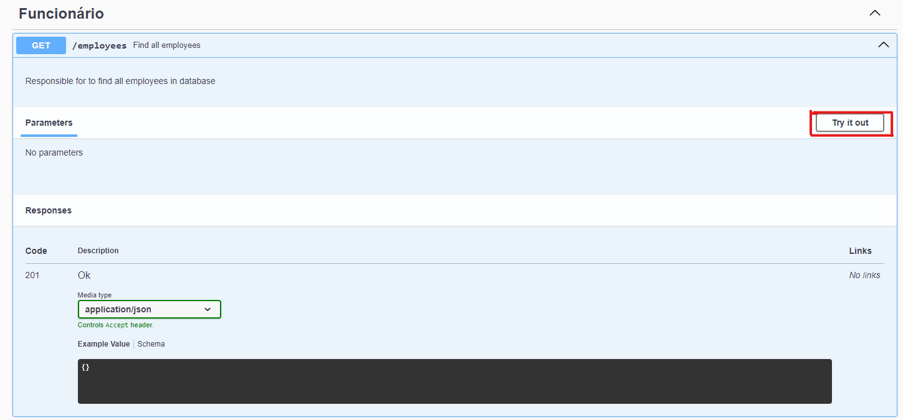

 # Informações sobre o projeto
Deve ser feito uma API na linguagem de preferência que realize as principais funções de um CRUD para um inventário de ativos de TI. 
Anexo está uma planilha com os campos que o inventário precisa ter. 

 ## Requisitos
- Inserir um novo funcionário
- Excluir um funcionário
- Listar todos os funcionários
- Consultar o inventário completo de um determinado funcionário
- Atualizar o nome do funcionário tendo como referência do documento o próprio CPF
- Atualizar as informações do ativo notebook
- Limpar as informações do ativo notebook
- Atualizar as informações do ativo monitor 1
- Limpar as informações do ativo monitor 1
- Atualizar as informações do ativo monitor 2
- Limpar as informações do ativo monitor 2
- Atualizar as informações do ativo teclado
- Limpar as informações do ativo teclado
- Atualizar as informações do ativo mouse
- Limpar as informações do ativo mouse
- Atualizar as informações do ativo nobreak
- Limpar as informações do ativo nobreak
- Atualizar as informações do ativo desktop
- Limpar as informações do ativo desktop
- Atualizar as informações do ativo headset
- Limpar as informações do ativo headset
- Atualizar as informações do ativo teclado
- Limpar as informações do ativo teclado
- Atualizar as informações do ativo celular
- Limpar as informações do ativo celular
- Atualizar as informações do ativo acessórios
- Limpar as informações do ativo acessórios

## Considerações
1. O projeto deve ser hospedado no GitHub como projeto público e o link do repositório compartilhado comigo para que eu possa executar na minha máquina.
2. O projeto deve estar completo, incluindo as instruções para que eu possa instalar as dependências e executar o projeto. Imagine que o tio deve ser capaz de ler essas instruções e rodar o projeto :-) 
3. Um funcionário só pode ser excluído se não houver nenhum ativo configurado para ele.
4. A quantidade de ativos que um funcionário pode ter não deve ser maior que a especificada na planilha. Por exemplo, um funcionário não pode ter 3 monitores ou 2 notebooks.

## Modelo proposto 

# Como rodar o projeto
## MongoDB
Nesta API não é obrigatório a criação de um database ou collection, somente ter o mongo instalado, pois ao criar um funcionario novo, automaticamente é criada um novo database e collection caso não haja nenhum existente ( database e collection ).
Mas se já houver não tem problema que ela faz uso da existente.

- Database = inventario
- Collection = ti 
- Com a estrutura de dados:

## API
1. Abrir terminal na pasta raiz do trabalho 
2. Rodar "npm install" no terminal para instalar dependências
3. Rodar "npm run dev" no terminal para iniciar a Api
4. Ele roda por padrão na url http://localhost:3000/

## Chamadas na API
1. Pode ser utilizado = PostMan, Insomnia ou qualquer outro
2. neste projeto foi adicionado o swagger para efetuar testes de uma forma mais simples 
3. Com a api rodando abriremos a URL: http://localhost:3000/api-docs/

### Para testar endpoints que não possui parametro em sua URL 
1. Selecione o endpoint que deseja testar 

2. Clique em "Try it out" para habilitar o botão para execução

3. Clique em "Execute" para fazer uma chamado no endpoint criado

4. Ele retorna a resposta da requisição no campo Responses

### Para testar endpoints que possuem parametro em sua URL 
1. Selecione o endpoint que deseja testar 

2. Clique em "Try it out" para habilitar a insersão do parametro CPF 
3. Inserimos o CPF no campo correspondente

4. Depois de inserido o CPF
5. Clique em "Execute" para fazer uma chamado no endpoint criado
6. Assim ele retornará a resposta da requisição

### Para testar endpoints que possuem parametro em sua URL e corpo (Body) preenchido ou não

1. Clique em "Try it out" para habilitar a insersão do parametro CPF 
2. Inserimos o CPF equivalente do funcionário
3. Podemos repara que ele possui um modelo json como exemplo do que se espera passar como body

4. Clique em "Execute" para fazer uma chamado no endpoint criado

5. Ele retorna a resposta da requisição no campo Response

6. Nas requisições com 'Clear_' são endpoints usados para limpar um ativo por isso não passamos body somente o CPF

7. Ele retorna a resposta da requisição no campo Response

